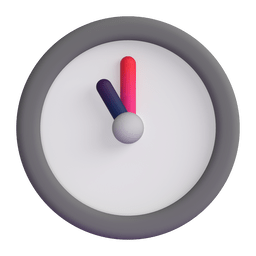

<h1 align="center">Hi there, I'm <a href="mailto:am5419@fayoum.edu.eg">Ahmed Abd ElGhany</a>

</h1>

Welcome to my GitHub profile! and you've reached my Dev space on the Web I'm a **Backend Developer** with a solid foundation in **Mathematics** and **Computer Science**. I enjoy building efficient and scalable applications, tackling complex problems, and learning new technologies. Let's create something amazing together!

- 🌱 I’m currently enhancing my skills in **JavaScript**, **Node.js**, and **RESTful APIs**.
- 👯 I’m looking to collaborate on exciting backend and full-stack projects.
- 💬 Ask me about **REST APIs**, **Node.js**, **MongoDB**, **Express.js**, **Data Structures**, **Algorithms**.
- 📫 How to reach me: [am5419@fayoum.edu.eg](mailto:am5419@fayoum.edu.eg)
- ⚡ Fun fact: I'm a competitive learner, winning top student competitions multiple times.
- 📝 Checkout my [CV](https://drive.google.com/file/d/1vq4a-th-gdj1vW_cU0LKYgxrI0Xc6shD/view?usp=sharing)

---

###  Tech Stack:

  
  
  
  
  
  
  
  
  
  
  
  
  
  

##  My GitHub Profile

1. Github Streaks 

Let's connect ❤️ and collaborate on exciting projects! 🏆

